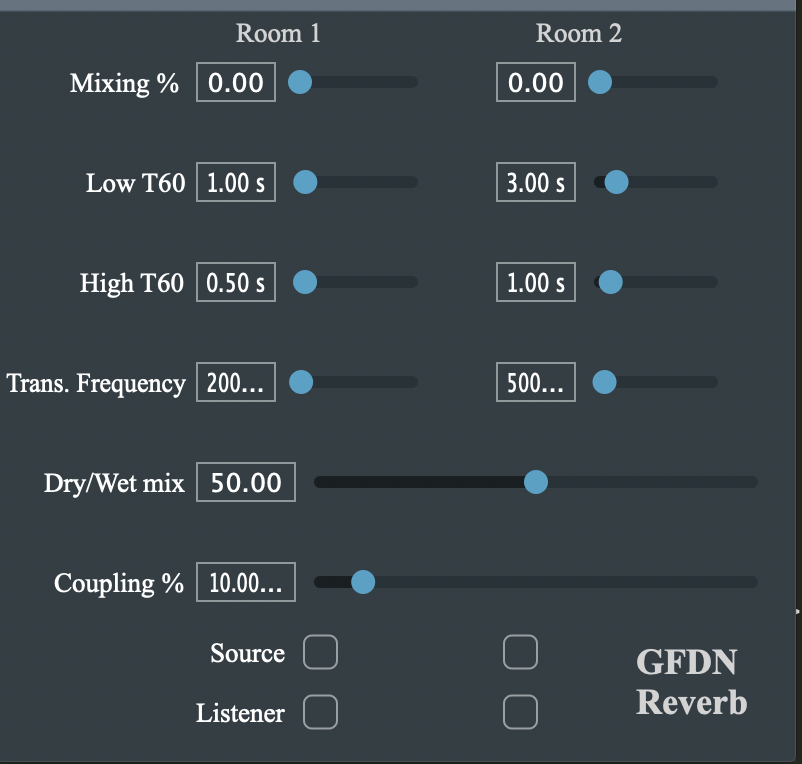

<h1> Grouped Feedback Delay Networks Reverb Plugin </h1>

 GFDNs connect multiple spaces with different reverberation times that exhibit multi-stage, anisotropic decay. A parameterized mixing matrix is used to control inter- and intra-group coupling in the GFDN. In this plugin, 2 coupled rooms are implemented with the GFDN. For more details, see 

<ul>
	<li><i><a href = "https://ccrma.stanford.edu/~orchi/Documents/DAFx2020_paper_25.pdf">Delay Network Architectures for Room and Coupled Space Modeling </a></i> - Das et al. in Proc. of International Conference on Digital Audio Effects, DAFx 2020. </li>
	<li> <i><a href = "https://ccrma.stanford.edu/~orchi/Documents/JAES21_GFDN.pdf"> Grouped Feedback Delay Networks for Modeling of Coupled Spaces </a></i> - Das and Abel, Journal of the Audio Engineering Society, JAES 2021.</li> 
	<li> <i> <a href = "https://ieeexplore.ieee.org/iel7/6570655/6633080/10128677.pdf"> Grouped Feedback Delay Networks with Frequency Dependent Coupling </a></i> - Das, Schlecht, and De Sena, IEEE/ACM Transactions on Audio, Speech and Language Processing, IEEE TASLP 2023.</li>
</ul>

<h3> External libraries : </h3>
	<ul>
		<li> <a href = "https://juce.com/">JUCE</a></li>
		<li> <a href = "https://eigen.tuxfamily.org/index.php?title=Main_Page">Eigen</a></li>
	</ul>
	

  

